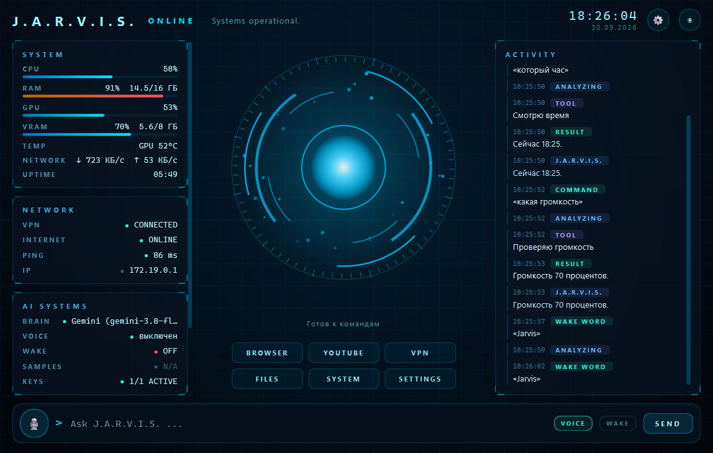
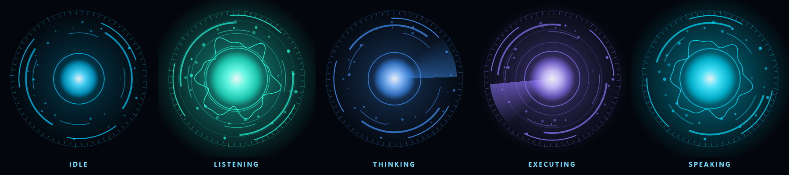

# J.A.R.V.I.S.

Голосовой ассистент для Windows в стиле JARVIS из «Железного человека». Понимает обычную русскую речь (и английскую),
сам выполняет действия на компьютере и отвечает голосом.



## Что умеет

- **Голос** — говоришь «Jarvis, …», он слушает, думает и отвечает. Есть push-to-talk (`Ctrl+Alt+J`) и текстовый ввод.
- **Живой режим Gemini Live** — модель слушает и отвечает голосом в реальном времени, её можно перебивать.
- **Приложения и окна** — открыть/закрыть программу, свернуть, развернуть на весь экран, переключиться.
- **Браузер и YouTube** — открыть сайт, найти видео, включить первый результат, «найди там…» по контексту.
- **Музыка** — пауза, дальше, громкость; Spotify через официальный API (включить трек, плейлист, лайк, очередь).
- **Steam** — список игр с наигранными часами, запуск игры, смена аккаунта (можно закрепить аккаунт за игрой).
- **Discord** — выключить/включить микрофон или наушники (с учётом текущего состояния), демонстрация экрана,
  камера, выйти из войса, открыть чат, отправить сообщение (с подтверждением), принять звонок.
- **Новости** — сам собирает свежие новости и пересказывает: общие, игровые (в приоритете Telegram-каналы), AI,
  наука, спорт. Браузер при этом не открывается.
- **VPN, папки, скриншоты, погода, время, блокировка** и другие системные команды.
- **Голосовые записи** — если у тебя есть фразы JARVIS из фильма, подходящие по смыслу ответы звучат ими.
- **Безопасность** — выключение, удаление, отправка сообщений и прочие опасные действия только после «да».

## Интерфейс

Главное окно — командный центр: живое ядро в центре реагирует на твой голос и показывает, что происходит,
слева — система, сеть и статус AI, справа — лента событий. При закрытии окна JARVIS не выключается, а уходит в
маленькое ядро в углу экрана (и в трей), продолжая слушать.



## Установка

Нужен Windows 10/11 и Python 3.12 (скачать: https://www.python.org/downloads/ — при установке поставь галочку
**Add Python to PATH**).

### Способ 1 — без git (проще всего)

1. Нажми зелёную кнопку **Code** вверху этой страницы → **Download ZIP**.
2. Распакуй архив, например, на рабочий стол.
3. Открой папку и запусти **`install.bat`** двойным щелчком — он всё установит сам.
4. Дальше — раздел «Настройка» ниже, потом запускай **`run_jarvis.bat`**.

### Способ 2 — через git

Команды вводятся в командной строке: нажми `Win + R`, напиши `cmd`, нажми Enter. В открывшемся чёрном окне по очереди:

```bat
cd %USERPROFILE%\Desktop
git clone https://github.com/Panx1k/jarvis.git
cd jarvis
install.bat
```

Первая строка переходит на рабочий стол, вторая скачивает проект в папку `jarvis`, последняя устанавливает.
Если пишет, что `git` не найден — установи его: `winget install Git.Git` (и открой `cmd` заново) или используй способ 1.

`install.bat` создаёт виртуальное окружение и ставит зависимости. Вручную то же самое:

```bat
python -m venv .venv
.venv\Scripts\pip install -r requirements.txt
.venv\Scripts\python scripts\download_vosk_model.py
```

Модели Vosk нужны для офлайн-распознавания слова «Jarvis».

Необязательно — локальный нейроголос XTTS (работает на видеокарте NVIDIA, весит несколько гигабайт):
`.venv\Scripts\pip install -r requirements-xtts.txt`, затем `TTS_ENGINE=xtts` в `.env`.
По умолчанию используется бесплатный онлайн-голос Microsoft Edge.

## Настройка

Скопируй `.env.example` в `.env` и впиши ключи. Ключи хранятся только в `.env` — в код, логи и интерфейс
они не попадают, а сам `.env` в `.gitignore`.

| Что | Переменная | Где взять |
|---|---|---|
| Мозг (бесплатно) | `GEMINI_API_KEY` | https://aistudio.google.com/apikey |
| Или OpenAI | `OPENAI_API_KEY_1`, `OPENAI_MODEL` | https://platform.openai.com/api-keys |
| Или локально | `OPENAI_BASE_URL=http://localhost:11434/v1` | [Ollama](https://ollama.com) |
| Spotify | `SPOTIFY_CLIENT_ID` | https://developer.spotify.com/dashboard |

Без ключей работают локальные правила: простые команды выполняются и так.

Личные настройки (пути к программам, аккаунты Steam, позиция мини-ядра) сохраняются в `config/settings.json`.
Источники новостей — в `config/news_sources.json` и `config/gaming_sources.json`, их можно менять.

## Запуск

```bat
run_jarvis.bat              :: окно
run_jarvis_console.bat      :: консоль
```

Или напрямую: `python main.py`, `python main.py --cli --voice`, `python main.py --minimized`.
Автозапуск вместе с Windows включается в настройках (⚙).

## Обновление

Скачивать заново не нужно. JARVIS сам проверяет новые версии на GitHub и пишет, когда вышло обновление.
Обновиться можно любым способом:

- сказать **«Jarvis, обновись»** (или спросить «есть обновления?»);
- ⚙ Настройки → **Обновления** → «Обновить»;
- запустить **`update.bat`**.

Ключи в `.env`, твои настройки, модели и изменённые списки источников при обновлении не трогаются.
Если проект скачан через `git clone` — обновление идёт через `git pull`.

## Примеры команд

| | |
|---|---|
| Приложения | «Открой Discord», «Закрой Chrome», «Сверни все окна», «Открой Steam на весь экран» |
| YouTube | «Открой YouTube и найди там музыку для учёбы» → «Включи первый результат» |
| Музыка | «Пауза», «Следующий трек», «Громкость 30», «Включи что-нибудь в Spotify» |
| Steam | «Какие у меня игры?», «Сколько я наиграл в КС?», «Запусти доту», «Смени аккаунт» |
| Новости | «Какие новости?», «Игровые новости», «Новости PlayStation», «Подробнее про вторую», «Откуда это?» |
| Система | «Который час», «Погода в Казани», «Сделай скриншот», «Включи VPN», «Заблокируй компьютер» |
| С подтверждением | «Выключи компьютер», «Напиши Васе в Discord…», «Удали игру…», «Обновись» |
| Остановить | «Стоп, Jarvis» / «Jarvis, хватит» — замолчит, закончит разговор и снова будет ждать «Jarvis» |

## Как устроено

```
Микрофон → слово «Jarvis» (Vosk, офлайн) → распознавание речи → мозг (правила + LLM)
        → инструменты → ответ → голосовая запись или синтез речи → динамики
```

```
jarvis/
  core/       ассистент, контекст диалога
  brain/      правила, LLM (Gemini / OpenAI / Ollama / Claude), ротация ключей
  tools/      инструменты: приложения, веб, медиа, Steam, Spotify, Discord, новости…
  services/   Spotify API, новости, VPN, медиа Windows
  voice/      микрофон, wake word, STT, TTS, Gemini Live, голосовые записи
  ui/         окно, живое ядро, мини-ядро, трей, настройки
plugins/      свои инструменты (подхватываются автоматически)
tests/        тесты (pytest)
```

## Свой инструмент

Положи файл в `plugins/` — JARVIS подхватит его при запуске, а мозг сам поймёт, когда его вызывать:

```python
from jarvis.tools.base import ToolResult, tool


@tool("coin_flip", "Подбросить монетку.", patterns=[r"^подбрось монетку$"])
def coin_flip(ctx):
    import random
    return ToolResult(True, random.choice(["Орёл.", "Решка."]))
```

## Тесты

```bat
.venv\Scripts\python -m pytest -q --ignore=tests/test_openai_live.py
```

`tests/test_openai_live.py` ходит в настоящий API и запускается, только если в `.env` есть ключ.

## Что не входит в репозиторий

- `.env` с ключами и `config/settings.json` с личными настройками;
- модели (`models/`, `Voice/`) — скачиваются отдельно;
- голосовые записи из фильма (`Samples/`) — положи свои, их смысл описывается в `assets/voice_samples/index.json`.
